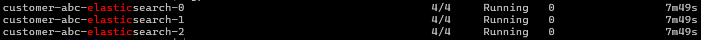

# WSD Assesment  


## Configuration Management
1. Ansible command to display ansible configuration for a host  
```ansible app_servers -m setup -i inventory.ini -e 'ansible_python_interpreter=/usr/bin/python3```
2. CronJob configuration yaml, [configure_cron.yml](./configuration-management/configure_cron.yml)
3. Ntp deploy configuration yaml, [deploy_ntp.yml](./configuration-management/deploy_ntp.yml)  
   Nagios deploy configuration yaml [deploy_nagios.yml](./configuration-management/deploy_nagios.yml)  


## Docker/Kubernetes
1. Refer to [docker-compose.yaml](./docker-kubernetes/docker-compose.yaml) for the code 
2. ```kubectl get pods -n production | grep internal | awk '{print $1}' | xargs -I {} kubectl describe pod {} -n production```
3. Possible reasons for pod restarts from a kubernetes perspective:
   1. **Memory limit exceeded:** The application is running at a very high memory which is close to the memory limit set in the pod. As the heap memory is already set to 1000M and java applications also has non-heap memory components, its likely that the application is randomly restarting because of memory outage.   
   command to check restart reason: ```kubectl describe pod java-app-7d9d44ccbf-lmvbc```
   2. **CPU Throttling:** During high load or heavy processing, the cpu might get throttled if sufficient cpu millicores is not available due to the set limit which will cause the java application to slow down and eventually restart.  
   command to check cpu (or memory) usage: ```kubectl top pod java-app-7d9d44ccbf-lmvbc```
   3. **Liveness/Readiness probe failures:** If the java-app has a liveness or readiness probe, frequent failures can force Kubernetes to restart it especially if the app has a slow performance and the requests are taking a long time to process.
   4. **CrashLoopBackOff:** The java-app pod may fall on a CrashLoopBackOff if the application has unhandled exceptions.  
   command to check exceptions: ```kubectl top pod java-app-7d9d44ccbf-lmvbc --previous```
   5. **Node-pressure Eviction:** If the nodes in the kubernetes cluster doesn't have the sufficient resources, then the kubelet might terminate the pod to reclaim resources in the node(s) thus causing the java-app to restart when starting the pod on another node.  
   command to check node status: ```kubectl describe node <node-name>```


## Helm
Helm install command for elasticsearch 
```helm install elasticsearch . --values ./envs/qa/customer-abc-elasticsearch/values.yaml```  

**Elasticsearch Running**  
  

**Elasticsearch Statefulset YAML**  
Refer to [customer-abc-elasticsearch.yaml](./helm/customer-abc-elasticsearch.yaml) for the code  
*Note:* The images and Fluentd container 'argument' has been modified


## Metrics
1. Prometheus is an open-source monitoring and alerting toolkit designed for reliability and scalability, widely used in cloud-native environments like Kubernetes. It excels at collecting, storing, and querying time-series data—metrics that change over time, such as CPU usage, request latency, or error rates. Prometheus works via pull mechanism whereby it scrapes data from it targets (from exporters) at configured intervals and then keeps the data in its on-disk time-series database from where it can be viewed by prometheus GUI (or other GUI) and then it can be queried using the powerful Prometheus Query Language (PromQL).  

    About Prometheus   
    * Prometheus server: This server hosts prometheus along with its db. This server contains a config file in the path /etc/prometheus.yml which contains all the targets. Scraping, storing, querying and GUI are all on this server  
    * Exporters: Exporters like node-exporter need to be installed on the target resources; prometheus pulls data from these exporter.   
    * Visualization: Prometheus provides a basic GUI where all the metrics and scraped data can be seen. Prometheus is mostly used as data sources for a more GUI tool like Grafana.  
    * Query: PromQL is the query language used to query the scraped data.  
    * Alertmanager: Alerts rules can be set which will send alerts to Alertmanager which will inturn send alerts to mails, slack-group, teams and other channels.  

2. Assuming that prometheus and alertmanager are deployed in the cluster, the belwo steps should suffice:
    1. Refer to [alert_podsCrash.yml](prometheus-grafana/alert_podsCrash.yml) file to be deployed for the prometheus pod alert rule  
    2. Restart prometheus  
    ```kubectl rollout restart deployment prometheus -n monitoring```
    3. If any pod is in Pending, Unknown or Failed state, this alert will be triggered and it can be seen from the <prometheus-url>/alerts or from <alertmanager-url>
3. Prometheus query to use in grafana ```rate(http_requests_total[5m])```


## Databases
1. Reasons
    1. **Eventual Consistency and Low Consistency Levels**: Cassandra is a distributed NoSQL database that prioritizes availability and partition tolerance (AP in CAP theorem), using an eventual consistency model. When you execute a query, the consistency level (e.g., ONE, QUORUM, ALL) determines how many nodes must respond for the query to be considered successful. If a weak consistency level like ONE is used for reads or writes, then it might not propagate to all replicas immediately thus remaining out of sync.  
    2. **Tombstone Resurrection**: Cassandra generates tombstones (markers indicating data is deleted) which are kept until the gc_grace_seconds period (default: 10 days) expires, after which compaction purges them. If a client writes to a previously deleted key before compaction occurs (and before all nodes sync), the tombstone can be overridden, effectively “resurrecting” the data.  
    3. **Replication Lag or Unrepaired Nodes**: Some nodes might be laggy due to network issues, high load, or downtime. Additionally, if nodetool repair hasn’t been run recently, deleted data (tombstones) might persist on some nodes.  

2. Assuming that the mongo-config and mongo-router servers has been setup and the shard clusters are created and added to router using mongo shell
    ```sh.addShard("shard_rs/replicaset_1:27017,replicaset_2:27017")```
    Steps:
    1. '_id' field is automatically generated by mongo and is indexed by default. With that being said, login to mongo router server  
      ```mongosh --host <mongo-router-host> --port 27017```
    2. Enable sharding for the db, sanfrancisco  
      ```sh.enableSharding("sanfrancisco")```
    3. Hashed sharding  
      ```sh.shardCollection("sanfrancisco.company_name", { "_id": "hashed" })```
    4. Check after sometime to see the distribution  
      ```db.company_name.getShardDistribution()```  
  
  ***Explanation***  
  Hashed sharding has been chosen because the '_id' field is an auto generated field by mongodb with a defualt index which increases sequentially; had ranged sharding been chosen, there will be an imbalance of data in the shards as the data in upper sequence will most likely go to the new sharded replicas and the performance of db will not drastically change (unless the other replicaset gets filled with data) as most of the queries will be queried from one replicaset.  
